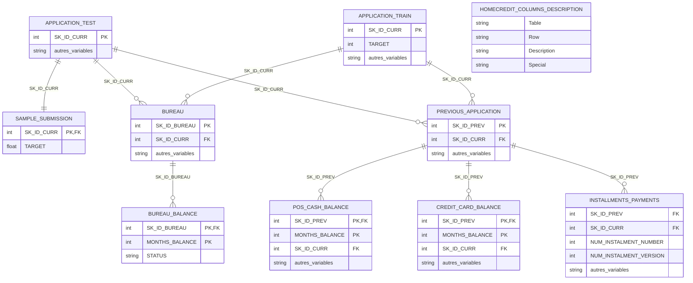

# Diagramme des tables et stratégie de jointure

## Objectif

Ce document décrit les relations entre tous les fichiers CSV de `data/raw/` et la
méthode recommandée pour construire une table consolidée avec **une ligne par
client** (`SK_ID_CURR`).

Les cardinalités et l'unicité des clés ont été vérifiées directement sur les
fichiers. Les données brutes n'ont pas été modifiées.

## Diagramme des relations



> `HomeCredit_columns_description.csv` est un dictionnaire de métadonnées : il
> décrit les colonnes, mais ne participe pas à la consolidation des observations.

## Rôle et granularité des fichiers

| Fichier | Nombre de lignes | Granularité observée | Clé ou identifiant principal |
|---|---:|---|---|
| `application_train.csv` | 307 511 | une ligne par client d'entraînement | `SK_ID_CURR` unique |
| `application_test.csv` | 48 744 | une ligne par client de test | `SK_ID_CURR` unique |
| `sample_submission.csv` | 48 744 | une prédiction par client de test | `SK_ID_CURR` unique |
| `bureau.csv` | 1 716 428 | un crédit externe par ligne | `SK_ID_BUREAU` unique |
| `bureau_balance.csv` | 27 299 925 | un mois par crédit externe | (`SK_ID_BUREAU`, `MONTHS_BALANCE`) unique |
| `previous_application.csv` | 1 670 214 | une ancienne demande par ligne | `SK_ID_PREV` unique |
| `POS_CASH_balance.csv` | 10 001 358 | un mois par ancienne demande | (`SK_ID_PREV`, `MONTHS_BALANCE`) unique |
| `credit_card_balance.csv` | 3 840 312 | un mois par ancienne demande | (`SK_ID_PREV`, `MONTHS_BALANCE`) unique |
| `installments_payments.csv` | 13 605 401 | une opération de paiement par ligne | aucune clé simple garantie |
| `HomeCredit_columns_description.csv` | — | une description de variable | métadonnées uniquement |

Dans `installments_payments.csv`, la combinaison `SK_ID_CURR`, `SK_ID_PREV`,
`NUM_INSTALMENT_NUMBER`, `NUM_INSTALMENT_VERSION` contient 653 483 doublons.
Elle ne doit donc pas être déclarée clé primaire. Plusieurs paiements peuvent
notamment correspondre à une même échéance.

## Colonnes de jointure recommandées

| Table source | Table cible | Colonne(s) | Cardinalité | Traitement recommandé |
|---|---|---|---|---|
| `sample_submission` | `application_test` | `SK_ID_CURR` | 1 vers 1 | jointure directe |
| `bureau` | application | `SK_ID_CURR` | plusieurs vers 1 | agréger `bureau` par client |
| `bureau_balance` | `bureau` | `SK_ID_BUREAU` | plusieurs vers 1 | agréger d'abord par crédit externe |
| `previous_application` | application | `SK_ID_CURR` | plusieurs vers 1 | agréger par client |
| `POS_CASH_balance` | `previous_application` | `SK_ID_PREV` | plusieurs vers 1 | agréger d'abord par ancienne demande |
| `credit_card_balance` | `previous_application` | `SK_ID_PREV` | plusieurs vers 1 | agréger d'abord par ancienne demande |
| `installments_payments` | `previous_application` | `SK_ID_PREV` | plusieurs vers 1 | agréger d'abord par ancienne demande |

Ici, « application » désigne soit `application_train`, soit `application_test`.
Ces deux tables ont la même structure de variables explicatives ; seule la table
d'entraînement contient `TARGET`.

## Ordre sûr de consolidation

L'objectif est de conserver exactement une ligne par `SK_ID_CURR` :

```text
bureau_balance
    -> agrégation par SK_ID_BUREAU
    -> LEFT JOIN avec bureau sur SK_ID_BUREAU
    -> agrégation par SK_ID_CURR
    -> LEFT JOIN avec application sur SK_ID_CURR

POS_CASH_balance / credit_card_balance / installments_payments
    -> agrégation séparée de chaque table par SK_ID_PREV
    -> LEFT JOIN avec previous_application sur SK_ID_PREV
    -> agrégation par SK_ID_CURR
    -> LEFT JOIN avec application sur SK_ID_CURR
```

Pour un modèle, il est généralement préférable de produire séparément :

- un jeu consolidé d'entraînement basé sur `application_train` ;
- un jeu consolidé de test basé sur `application_test` ;
- exactement le même calcul de variables dans les deux jeux.

La jointure finale doit être une **jointure gauche** (`LEFT JOIN`) depuis la table
`application`. Ainsi, un client sans historique reste dans le jeu de données ; les
variables historiques correspondantes seront manquantes ou remplacées selon la
stratégie de préparation retenue.

## Contrôles de qualité à conserver

Avant et après chaque jointure :

1. vérifier l'unicité de la clé dans la table agrégée ;
2. vérifier que le nombre de lignes de la table `application` ne change pas ;
3. mesurer le nombre de clés absentes plutôt que de les supprimer silencieusement ;
4. vérifier que `TARGET` ne sert jamais à construire les agrégats ou à préparer le test.

L'analyse a relevé des identifiants enfants absents de leur table parente dans les
fichiers fournis : 43 041 `SK_ID_BUREAU` dans `bureau_balance`, ainsi que certains
`SK_ID_PREV` dans les trois tables d'historique interne. Une jointure gauche depuis
la table parente ignore naturellement ces historiques orphelins. Ce constat doit
être conservé comme contrôle de qualité, et non corrigé artificiellement.

## Exemple minimal en pandas

```python
# ---------- Agrégation mensuelle au niveau du crédit externe ----------
bureau_balance_agg = (
    bureau_balance
    .groupby("SK_ID_BUREAU", as_index=False)
    .agg(
        BUREAU_MONTH_COUNT=("MONTHS_BALANCE", "count"),
        BUREAU_MONTH_MIN=("MONTHS_BALANCE", "min"),
        BUREAU_MONTH_MAX=("MONTHS_BALANCE", "max"),
    )
)

# ---------- Rattachement au crédit puis agrégation au niveau client ----------
bureau_by_client = (
    bureau
    .merge(bureau_balance_agg, on="SK_ID_BUREAU", how="left", validate="one_to_one")
    .groupby("SK_ID_CURR", as_index=False)
    .agg(
        BUREAU_CREDIT_COUNT=("SK_ID_BUREAU", "count"),
        BUREAU_MONTH_COUNT_MEAN=("BUREAU_MONTH_COUNT", "mean"),
    )
)

# ---------- Consolidation sans perte de clients ----------
application_consolidee = application.merge(
    bureau_by_client,
    on="SK_ID_CURR",
    how="left",
    validate="one_to_one",
)
```

Le paramètre `validate="one_to_one"` sur les tables déjà agrégées transforme une
erreur de granularité en exception explicite, au lieu de dupliquer silencieusement
les clients.
